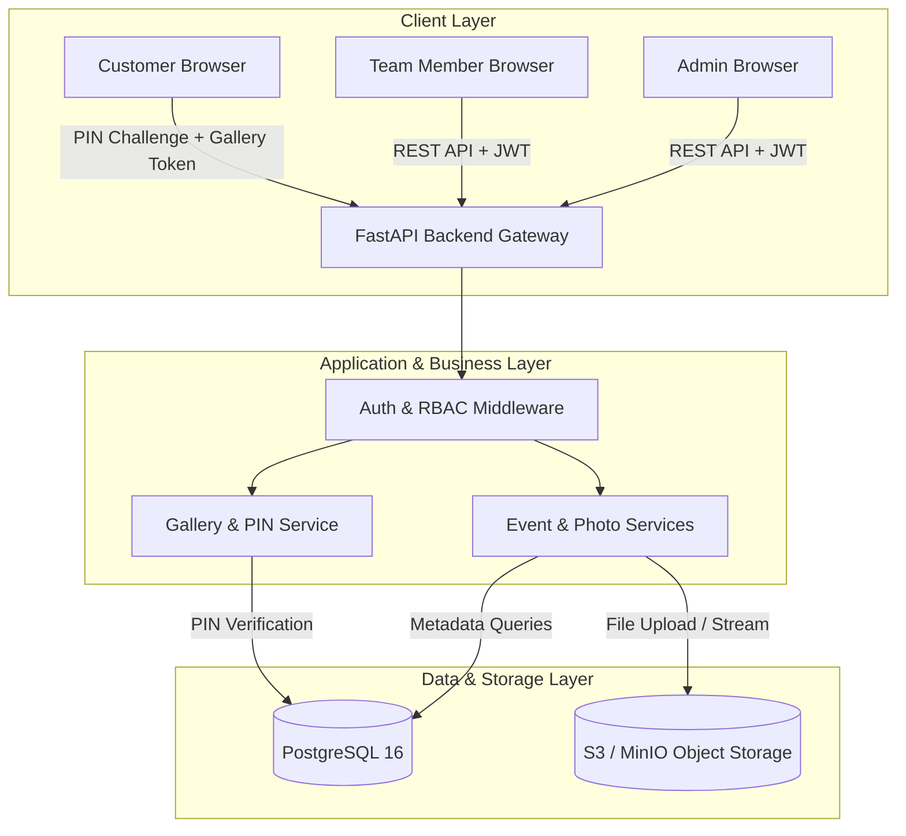
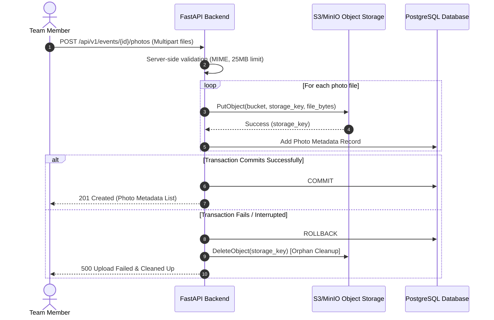

# TrizenAI Photo Sharing Platform - System Architecture & Design Document

A full-stack, enterprise-grade collaborative event photo sharing platform designed for photography teams, leads, and customer galleries.

---

## 1. Executive Summary & Tech Stack

| Layer | Technology | Key Architectural Rationale |
| :--- | :--- | :--- |
| **Frontend** | React, TypeScript, Vite, Tailwind CSS | High-performance SPA with strict typing, responsive photography grid layouts, and glassmorphism UI. |
| **Backend** | Python, FastAPI, Pydantic v2 | High-concurrency async REST API, auto-generated OpenAPI schemas, strict request/response data contracts. |
| **Database** | PostgreSQL 16, SQLAlchemy 2.0, Alembic | ACID relational compliance, foreign key constraints, indexes on lookup keys, async DB pooling (`asyncpg`). |
| **Object Storage** | AWS S3 / MinIO | Scalable binary storage with metadata mapping in PostgreSQL. Images are streamed via secure proxy to prevent public key exposure. |
| **Authentication** | PyJWT, Passlib (bcrypt) | Stateless JWT bearer tokens for users; short-lived signed JWT session tokens for customer PIN verification. |
| **Containerization** | Docker, Docker Compose | Reproducible local & production environment orchestration. |

---

## 2. Architecture Diagram

---

## 3. Security & Access Control Model

### 3.1 Role-Based Access Control (RBAC)
- **ADMIN**: Can create events, assign team members, review all uploaded photos, delete any photo, create galleries, select gallery photos, set PINs, and publish galleries.
- **TEAM_MEMBER**: Can view assigned events, upload multiple photos, view uploaded photos. **STRICTLY BLOCKED** from creating galleries, publishing galleries, managing users, or accessing unassigned events (Enforced server-side with HTTP 403 Forbidden).
- **CUSTOMER**: Requires **no user account**. Accesses published galleries via shareable URL (`/gallery/:slug`) and 4-8 digit numeric PIN.

### 3.2 Gallery PIN Security & Customer Access Tokens
1. **PIN Hashing**: PINs are never stored in plaintext. They are hashed using `bcrypt` and stored in `galleries.pin_hash`.
2. **PIN Verification Endpoint**: `POST /api/v1/public/galleries/{slug}/verify` receives the PIN, verifies it against `pin_hash`, and issues a short-lived, signed JWT `gallery_access_token` scoped specifically to that `gallery_id`.
3. **Protection of Unpublished Photos**: `GET /api/v1/public/galleries/{slug}/photos` requires `X-Gallery-Token`. The backend verifies the token and returns **ONLY** photos associated in `gallery_photos` for that published gallery. Unauthenticated requests or invalid PINs receive an explicit HTTP 401/403.

---

## 4. Object Storage & Upload Failure Rollback Flow

---

## 5. Technical Interview Questions & Answers

### Q1: Why did you choose this tech stack?
> **Answer**: React + TypeScript + Vite provides instant HMR and type safety on the frontend, while FastAPI + SQLAlchemy 2.0 provides sub-millisecond async performance, automatic OpenAPI docs, and clean Pydantic v2 schemas. PostgreSQL guarantees relational integrity for events, assignments, and gallery associations, while S3 handles binary storage scalability.

### Q2: Why object storage instead of storing images in PostgreSQL?
> **Answer**: Relational databases are optimized for structured tabular data, indexing, and transactional integrity. Storing binary image BLOBs directly in PostgreSQL bloats the database, degrades vacuum performance, degrades backup/restore times, and exhausts database connection pools. Object storage (S3/MinIO) is purpose-built for scalable static media distribution.

### Q3: How are unpublished photos protected from unauthorized customer access?
> **Answer**: Customer APIs (`/api/v1/public/galleries/{slug}/photos`) do not query event photos directly. They join `gallery_photos` with `galleries` and enforce `galleries.status = 'PUBLISHED'` alongside a verified `gallery_access_token`. Unpublished photos or photos from other galleries are strictly inaccessible.

### Q4: How is gallery PIN brute-force attack prevented?
> **Answer**: PINs are hashed using bcrypt with custom cost factors. The system rate-limits verification endpoints (`POST /verify`), and successful PIN verification yields a short-lived gallery-scoped JWT token (expires in 120 minutes) rather than exposing persistent gallery state.

### Q5: How would this architecture scale to 100,000+ photos?
> **Answer**: 
> 1. **Database Pagination**: Implement cursor-based pagination (`created_at` or `id` range) on photo listings.
> 2. **CDN Acceleration**: Serve public gallery images directly via Cloudflare/AWS CloudFront linked to S3 presigned short-lived URLs.
> 3. **Asynchronous Processing**: Offload image thumbnail generation and WebP optimization to a background Celery / Redis worker queue.
